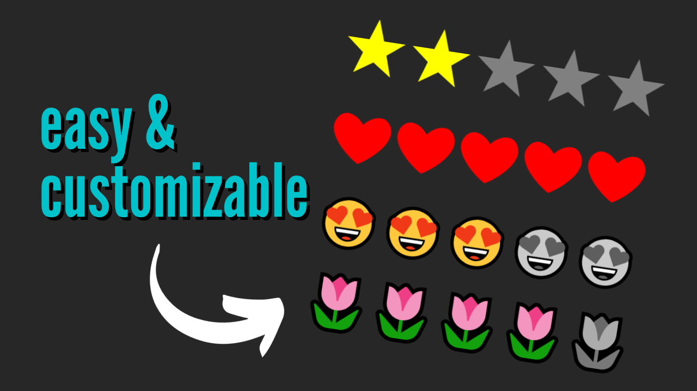

# React Customizable Rating Component

This repository serves as a complete code backup for the tutorial featured in my YouTube video on building a highly customizable rating component in React. 🚀 Check out the tutorial [here](https://youtu.be/J-gURMj3M6A) to learn how to create a dynamic rating system with adjustable text/emoji icons, colors, sizes, and the flexibility to set the number of icons for different rating scales.

## Getting Started 🚀

👩‍💻 To explore the completed project code, simply clone or download this repository. You can then customize and further develop the app to suit your needs.

To install all dependencies run `yarn` or `npm install`.

To start the app run `yarn dev` or `npm run dev`.

Happy coding!
